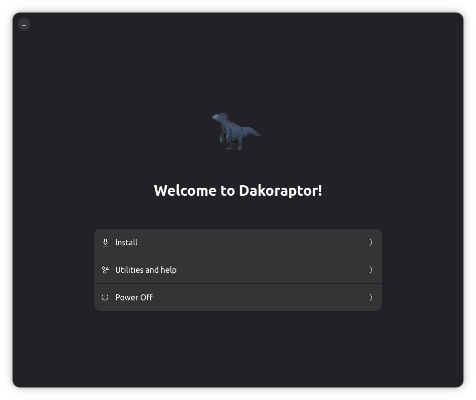

<div align="center">
    
    <h1>Dakota OS Installer</h1>
    <p>Adwaita installer for ProjectBluefin's Dakoratpor.</p>
    <hr />

Experimental installer for Dakoraptor, uses a minimal fork of Vanila-Installer as a base.
</br>
</a>
    <br />
    
</div>

## Build

### Dependencies

- build-essential
- meson
- libadwaita-1-dev
- gettext
- desktop-file-utils
- libgnome-desktop-4-dev
- libgweather-4-dev
- python3-requests
- gir1.2-vte-3.91
- libnma-dev
- libnma-gtk4-dev
- mutter-common
- x11-xkb-utils

### Build

```bash
meson build
ninja -C build
```

### Install

```bash
sudo ninja -C build install
```

## Run

```bash
dako-installer
```